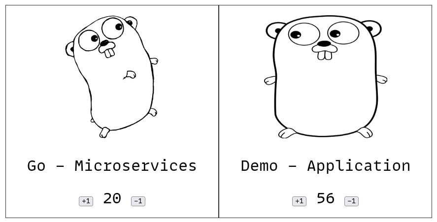

# Example microservice application

This repository is an example microservice architecture application

[](https://mermaid.live/edit#pako:eNpdUstuwjAQ_JWVz0S9o6oS4REOtCDKqQmHxXESq4ltOZu2CPj3OnZ4tCfPzox3x48T4zoXbMygqPU3r9ASrLaZgrY7lBZNBRNjasmRpFaOBsilFbyvgg9gki6sVhTNVQ6JftqJxtR7r8RpjPxzEAI1TWdIeMBWwEa3VFrROiH0gecoejmX2830DHFo4CmYDg6_CJU_xttZLArJvf4YLt4NFMAsXWnetQR9a6CwYX-T51e5IjJ_5DDKNYA-RYg093gSEt1SrA-tsF94kLWkY7Q2fQSse8v_61qkG6sbQZXoWj9kmb65F4D5j9GWhPVckiYuBirsqzBq4ucuehjf4cLDJFiWd355TXmF8XAeNmKNsA3K3L35qScz5rI0ImNjB3NRYFdTxjJ1cVbsSL8fFWdjsp0YMau7smLjAuvWVZ3JkcRMoruD5sYaVB9a32uRS9L2Nfwy_9kuv2BsyCw)



# Development
To enter into an environment with all necessary tooling installed:
```console
nix develop
```
This will enter an environment with all the packages listed in the mkShell in  the [nix flake](./flake.nix)

# Deployment
## Individual services
### Database
Start a Postgres database on port 5432, and run the [sql migration script](./server/create-tables.sql)

This can be done with Docker as follows:
```console
cd server
docker compose up -d
```

To remove the database and all data in it:
```console
docker compose down -v
```

### Database Client
Requires a running Postgres database, which is set with `DATABASE_ADDRESS` and defaults to `localhost:5432`
Use Go to build and run the client:
```console
cd server
go run main.go
```
This will start a gRPC server on :50051 and a http server on port :2121

### Front-end
Requires [templ](https://github.com/a-h/templ/) to be installed.
Use Go to build and run the front end:
```console
cd front
templ generate
go run .
```
This will start a http server on port :3000

## All-in-one
Deployment scripts are in the [deployments directory](./deployments/) and contains instructions on running the application with: [Docker Compose](https://docs.docker.com/compose/), [Docker Swarm](https://docs.docker.com/engine/swarm/) and [Kubernetes](https://kubernetes.io/).
