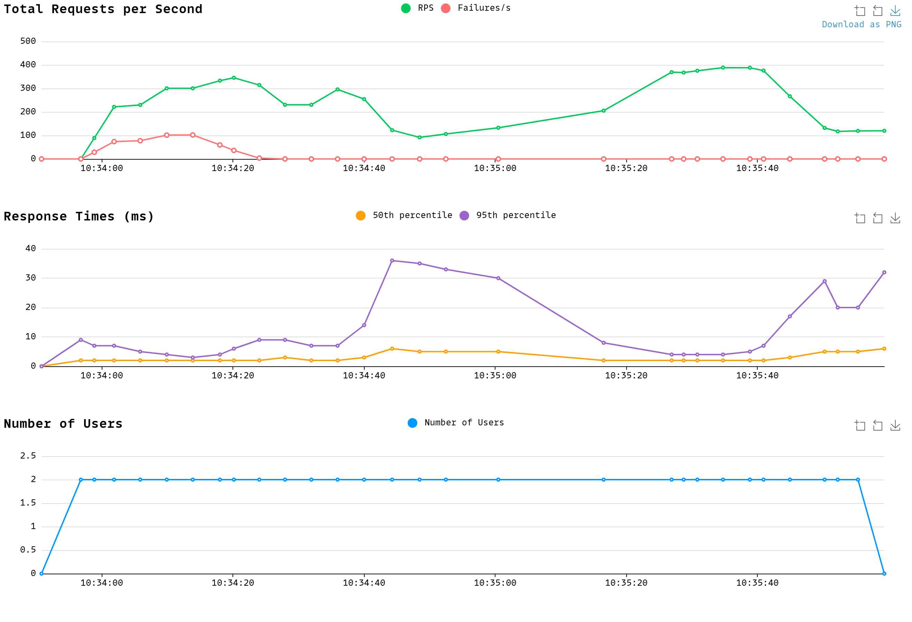

# Scripts
## Load testing with Locust
Requirements for the Locust load testing can be installed using
```console
pip install -r requirements.txt
```

Then the locustfile can be run using either the Locust web GUI or the headless CLI

Results should look similar to the following:

